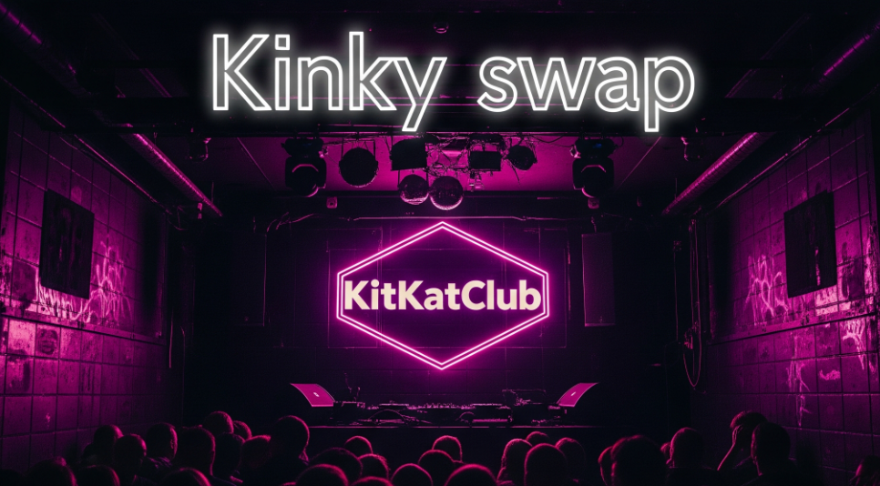
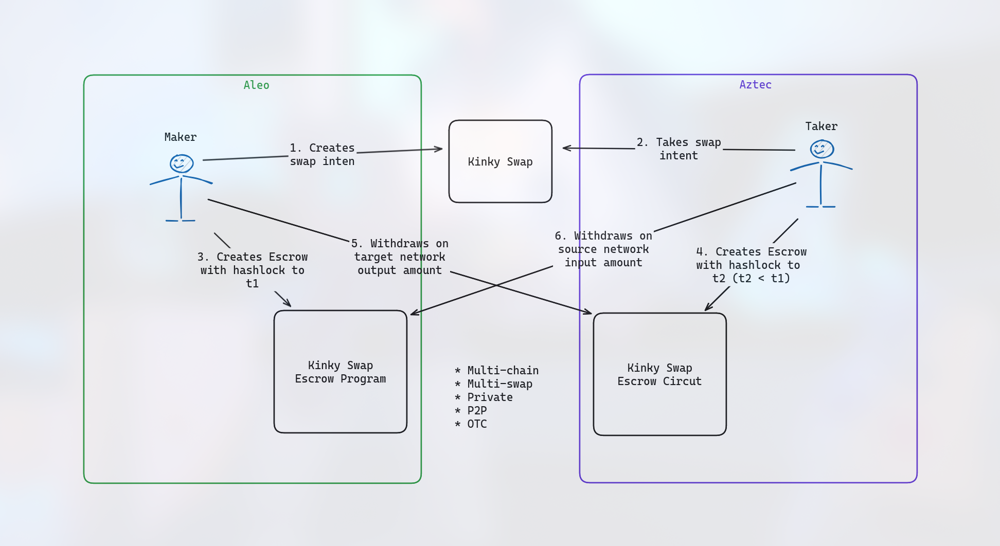

# Kinky Swap 🔐



## Getting Started

```bash
git clone --recurse-submodules https://github.com/GianfrancoBazzani/zkHack-Berlin-Kinky-Swap
```

## Architecture


## Swap Phases
1. The maker generates a secret and posts in Kinky Swap the intent to make a cross-chain swap with the hash of the secret.
2. The taker takes the intent, the maker is notified. 
3. The maker locks the input amount in the source escrow contract. The tokens will be locked until a deadline time t1.
5. The taker locks the output amount in the destination escrow contract. The tokens will be locked until a deadline time t2 (t2 < t1).
6. If the maker is ok it will withdraw the output amount from the escrow contract in the destination chain effectively revealing the secret.
7. The taker will have a time t1-t2 to withdraw the input amount on the origin chain safely.


## Deployments

### Aleo 

   - [Kinky Token Manager](https://testnet.aleoscan.io/program?id=kinky_token.aleo)
   - [Kinky Swap Escrow](https://testnet.aleoscan.io/program?id=kinky_swap_escrow_v0.aleo)

### Aztec
   - [Kinky Token](https://aztecexplorer.xyz/address/0x29fe8914d01c5360cb747d02e70a47f0039d0cfbd736b691d7de582bee2f7547)
   - [Kinky Swap Escrow](https://aztecexplorer.xyz/address/0x1951a69527f1b83ee989c9620cc55b9b38d92f9d300995ff5e15a9bfe2912192#bytecode)

## Notes

### Links

[1INCH FUSION+ | INTENT-BASED ATOMIC CROSS-CHAIN SWAPS](https://1inch.io/assets/1inch-fusion-plus.pdf)

Aleo:
   - [Testnet faucet](https://discord.com/channels/913160862670397510/1202322326230937640)
   - [Leo docs](https://docs.leo-lang.org/leo)
   - [Leo naming conventions](https://developer.aleo.org/guides/leo/leo_best_practices)
   - [Aleo Standard programs](https://github.com/demox-labs/aleo-standard-programs/tree/main)
   - [https://zlearn.gitbook.io/zlearn](https://zlearn.gitbook.io/zlearn)
   - [Leo Core Functions](https://zlearn.gitbook.io/zlearn/introduction-to-leo/3.7-operators#core-functions)
   - [Leo Wallet SDK](https://docs.leo.app/aleo-wallet-adapter)
   - [Check Transactions](https://docs.explorer.provable.com/docs/api-reference/28l42jqxvwhs7-get-confirmation-status-of-transaction)

Noir:
   - [Aztec Testnet Info](https://docs.aztec.network/try_testnet)
   - [Aztec Playground](https://play.aztec.network/latest/)
   - [Token Tutorial](https://docs.aztec.network/developers/guides/getting_started_on_testnet)

### Commands

Aleo SDK:
   - To test Leo programs locally without network, simply run command `leo run <FUNCTION_ID> <FUNCTION_ARGUMENTS>` 
   - To execute a transaction on the network `leo execute <program>/<function> <arguments>  --broadcast`
   - To fetch records: `snarkos developer scan --endpoint http://localhost:3030 --private-key <PRIVATE_KEY> --start 0 --network 1`
  - To install an external programs to your program as dependency:  `leo add --path ../token_registry/ --network testnet`

Aztec SDK:
 - To display aztec-wallet aliases: `aztec-wallet get-alias`
 - To mint KinkyToken: `aztec-wallet send mint_to_private --node-url $NODE_URL --from accounts:my-wallet --payment method=fpc-sponsored,fpc=contracts:sponsoredfpc --contract-address kinky_token  --args accounts:my-wallet accounts:my-wallet 10`